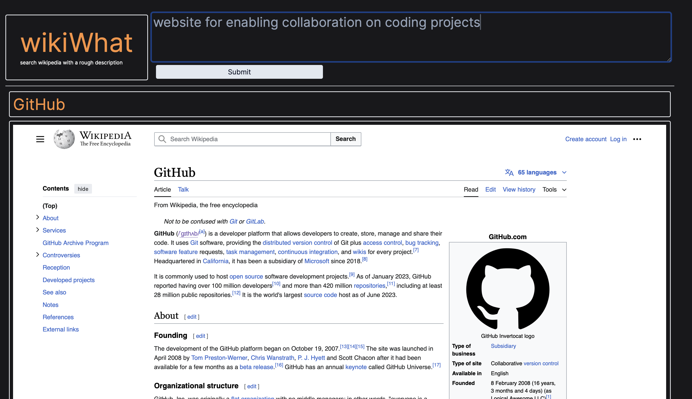

# wikiWhat
wikiWhat is a web app that, given a description by the user, finds a corresponding Wikipedia article and displays it.

## Acknowledgements
APIs used:
- [OpenAI (GPT3.5)](https://openai.com/api/)
- [Wikipedia](https://api.wikimedia.org/wiki/Getting_started_with_Wikimedia_APIs)